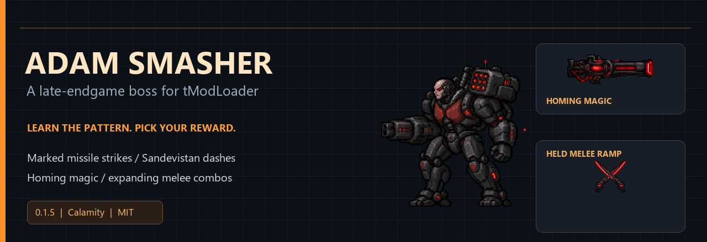
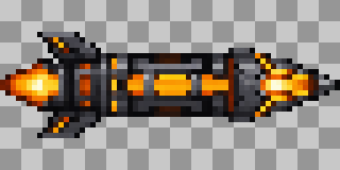
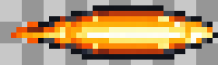

# Adam Smasher

[English](README.md) · [Русский](README.ru.md)

Неофициальный босс по мотивам Cyberpunk для позднего прохождения с Calamity. Учи ракетные зоны, прицельные очереди и серии рывков «Сандевистана», а за победу получай одно из двух мощных оружий.

**[Скачать AdamSmasher.tmod](https://github.com/Doffi4/adam-smasher-tmodloader/releases/latest/download/AdamSmasher.tmod)** · [Все файлы релиза](https://github.com/Doffi4/adam-smasher-tmodloader/releases/latest)

## Бой

Перед атакой последние 24 игровых тика прицел неподвижен. Ракеты доставляют взрывы в отмеченные круги: 3 точки в первой фазе, 5 во второй. Каждая очередь и рывок получают новое предупреждение. Во второй фазе ракеты переходят в отдельно предупреждённую пулемётную очередь.

Базовое здоровье — **18 млн**, защита — **110**. Контакт — **600 только в активном рывке**; исходный урон пули/взрыва — **350/450** до сложности, защиты и сторонних модификаторов. Баланс предварительный.

## Две награды, один дроп

Каждый бросок независимо выдаёт **ровно одно оружие, 50%/50%**; повторения возможны. В Normal оружие выпадает напрямую, в Expert/Master — из мешка босса.

| Оружие | ЛКМ | ПКМ |
| --- | --- | --- |
| **Протокол уничтожения** | Две самонаводящиеся ракеты; 10 базовой маны за пару; взрыв по вторичным целям | Заряд 1–2 секунды: тяжёлый плазменный выстрел и анимированное поле урона |
| **Клинки богомола «Арасака»** | Удержание 2 секунды: урон до +50%, радиус со 175 до 315 px; комбо из трёх ударов | Бросок двух клинков к курсору с возвратом |

## Установка

1. Установи **Calamity Mod** и **Calamity Mod Music**. Проверенные версии: 2.2.2 / 2.1. BossChecklist 2.2.4 необязателен.
2. Скачай `AdamSmasher.tmod` и положи в папку `Mods` профиля — её можно открыть из меню модов tModLoader.
3. Включи мод и перезапусти игру. **У всех игроков и сервера должна стоять 0.1.5.**

Можно играть в существующем мире, генерация структур не нужна. Призыв — нерасходуемый **Маяк «Арасака»**: **5 Shadowspec Bar + 25 Mysterious Circuitry + 25 Dubious Plating** у **Draedon's Forge**. При другом активном боссе призыв заблокирован.

Для удаления отключи мод и перезагрузи моды. Пока мод выключен, его предметы станут unloaded items. Перед изменением сборки сохрани резервную копию мира и персонажа.

## Графика

Это превью спрайтов, а не кадры игрового боя.

| Бронированная ракета | Плазменная пуля |
| :---: | :---: |
|  |  |

## Проверки и совместимость

Повторная проверка **2026-10-07**: сборка, 27 групп проверок босса, жизненный цикл и оружие, 1000 настоящих открытий мешков, рецепт/локализация/BossChecklist и изолированная загрузка с Calamity. [Подробности](docs/TESTING.md).

Серверное владение AI и снарядами проверено в engine fixtures. **Транспорт нескольких реальных клиентов, GPU-визуал, весь сторонний модпак и сложность/DPS на конкретном сете не подтверждены.** Проверка столкновений не доказывает невозможность AFK-победы. Совместимость со всеми аддонами Calamity не обещается.

Об ошибке можно сообщить в [Issues](https://github.com/Doffi4/adam-smasher-tmodloader/issues): версии, шаги воспроизведения и нужный фрагмент лога. Удали из лога аккаунты, IP и личные пути.

## Исходники

C# 12 / .NET 8. Игровые DLL и зависимости не распространяются. [Сборка](docs/BUILD.md) · [История изменений](CHANGELOG.md) · [Авторство](docs/CREDITS.md).

Код и оригинальные материалы проекта — MIT. Adam Smasher, Arasaka и Cyberpunk принадлежат соответствующим правообладателям; проект неофициальный. Создан с OpenAI Codex (семейство агентов GPT-6), графика — AI-генерация и подготовка спрайтов. [Attribution](ATTRIBUTION.txt).
